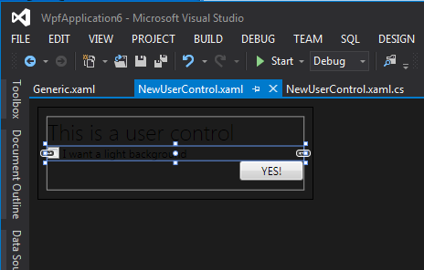
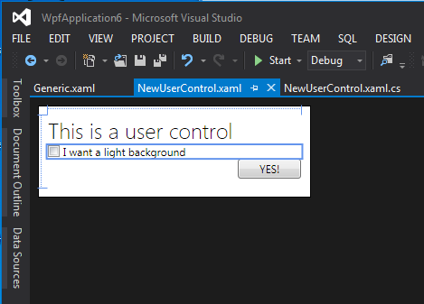

I really like the new Visual Studio 2012. And the dark theme looks cool and is so much easier for the eyes.

But there is a real problem when you’re working with User Controls in designer. And we have lots of them. What is the problem then? Look at the picture:



Yup, that is a UserControl with few elements on it. With a default transparent background it’s is hardly visible on design surface. In runtime, when put on a parent (usually a Window) it will take background of the parent and all elements will be visible.

Looking trough the VS2012 settings I’ve seen options to customize Windows Form Designer, Workflow and HTML Designers but nothing about customizing the XAML designer. Pretty bad, Microsoft.

In this case Styling comes to the rescue! With some styling and by using a trigger to enable the style only for Design Time, we’ll get this:



Much better now! To achieve it you have to put a small XAML fragment in your Generic.xaml or App.xaml and you should be done:

```
<Style TargetType="{x:Type UserControl}">
    <Style.Triggers>
        <Trigger Property="ComponentModel:DesignerProperties.IsInDesignMode"
                 Value="true">
            <Setter Property="Background"
                    Value="White" />
        </Trigger>
    </Style.Triggers>
</Style>
```

That’s how you’ll have your views well visible (and actually, design-able) in dark theme.

### Update:

I've looked again if there are any options in Visual Studio 2012 to lighten a bit the dark background in designer. And found an [issue reported on Microsoft Connect](http://connect.microsoft.com/VisualStudio/feedback/details/758745/wpf-designer-unusable-in-dark-theme) about this very problem. Unfortunately, this is "by design" and cannot be customized, at least yet:

> Yes, this is an unfortunately limitation in Visual Studio 2012 RTM. We would have loved to have the ability to change the default background color of the design surface, but could not get around to it (we have it on our backlog).


And a user has even posted a workaround that is mostly the same as above...
